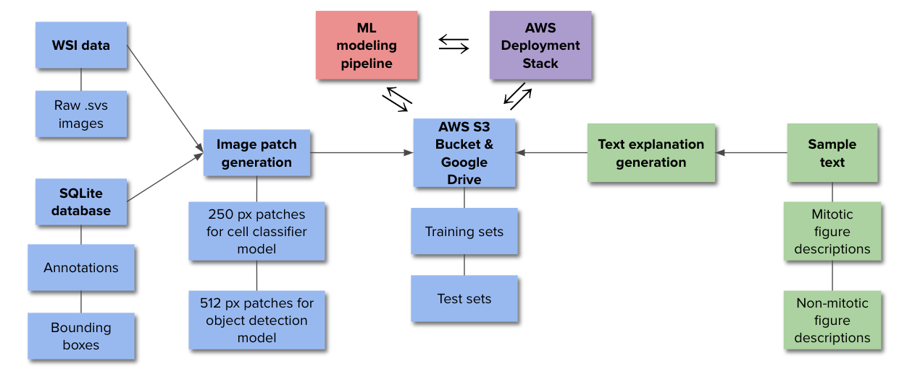
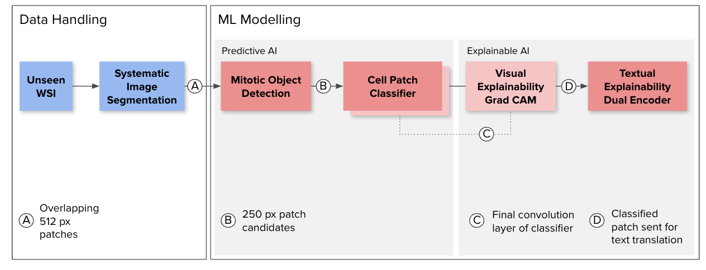
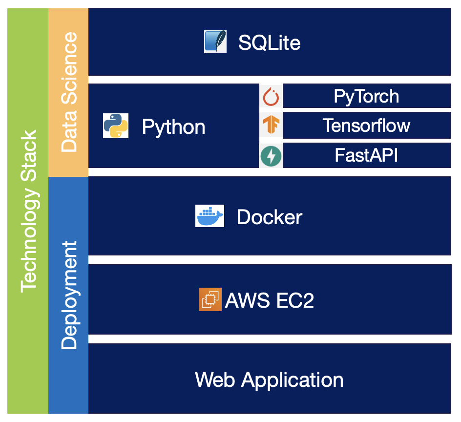

# Automating Explainability in Healthcare

## Project Description
### Motivation
The purpose of this project is to use AI and machine learning to flag cancerous cells on whole slide images of tissues. 
Today, the identification of mitotic cells is manually done by pathologists reviewing highly enlarged images and recording
annotations in a tool. This is difficult as it requires subject domain expertise, it is difficult to articulate reasons,
and often times costly due to conflicting diagnosis of the same image by different pathologists.

### How can AI and Machine Learning Help?
Using artificial intelligent techniques in computer vision, we can train models on cancerous images of canine tissue before
testing efficacy on human tissue. AI can detect similar cancerous areas missed by the human eye in existing images and in
newer images. We have trained simple NN models on annotated tissue data and look to further use NLP to assign texts to these
diagnosis. The goal is to have a report that meets the standards of a typical pathologist before it reaches other medical doctors.

### Challenges We Faced
Some of the challenges we faced include acquiring the same dataset used by the original authors of this project as there
were unknowns in technologies used and sometimes conflicting versions. Other challenges included finding the appropriate text
to further annotate the slide images to provide a robust explanation to doctors. Other challenges included creation of a
machine learning pipeline that seamlessly accepts a slide image as an input and outputs a detailed report.

## How to Use the Project Repo
### Folder Structure
- `deliverables/` contains weekly deliverables related to the progression of this project.
- `data/` folder (not visible) contains the image data that is saved locally. It is empty as it is good practice to exclude data from
the repo using a .gitignore file.
- `notebooks/` contains jupyter notebooks for data science work and training our models
- `prework/` contains the [original authors](https://github.com/DeepPathology/MITOS_WSI_CMC/) repo from their [paper](https://www.nature.com/articles/s41597-019-0290-4#Sec10) that this work is based off of
- `src/` contains the source code to run our FastAPI web application
### src/ Folder Structure
- `data/` contains [extract-patches.ipynb](src/data/extract-patches.ipynb) to generate image patches and annotation bounding box info from WSIs for model training or running inference. It points to `prework/databases` and the WSI images on your local setup. Refer to [Setup.ipynb](prework/setup.ipynb) in `prework/` to download the WSI images from figshare (very large files)
- `models/` contains the finetuned model weights and files
    - PyTorch FasterRCNN object detection model (CODAEL_OD_v1_weights.pth)
    - PyTorch Resnet18 cell patch classifier (patch_classifier_CODAEL_v0_weights.pth)
    - Tensorflow dual-encoder model (vision_encoder, text_encoder, unique_texts.csv)
- `static/` and `templates/` contain files for the web app
- `main.py` is a FastAPI implementation of our application that launches a web UI where a user can upload a WSI image, run inference, and return a report with a heatmap, text explanations of mitotic detections, and summary statistics
- `process.py` contains class Mitosisdetection and is called by `main.py`. It loads the models and provides two methods
    - `def predict:` runs inference on the input image
    - `def process_result:` generates dictionary of summary statistics
- `model.py` contains class detection and is called by `process.py`. It provides all the methods for processing the input image, running inference, and generating heatmaps and text explanations
### Miscellaneous Files
- This repo has a `.gitignore` file to remove any local work/data not needed for the repo.
- This repo has a `requirements.txt` file that matches exactly what was needed to run all code in this repo successfully.

## How to Run the FastAPI application
### Launch FastAPI app locally w/o Docker
1. Ensure packages in [requirements.txt](requirements.txt) are installed in a new conda or pip virtual environment running Python 3.8 and that the new environment is activated. For conda, you may run these commands in a terminal
    - `conda create --name my-environment python=3.8 pip`
    - `conda activate my-environment`
    - `pip install -r requirements.txt`
2. Open a terminal and cd into `src/`
3. Run command `python main.py` or `python3 main.py`, app will take up to a minute to load models and launch
4. Open a web browser and enter `localhost:8000/images' to access the web UI
### Launch FastAPI app on AWS EC2 w/GPUs
These are the instance settings we used.
- Deep Learning AMI GPU PyTorch 1.12.1 (Amazon Linux 2)
- Instance type: p3.2xlarge
- Auto-assign public IP = Enable
- Allow HTTP and HTTPS traffic: Source type = Anywhere
- Added security group Custom TCP: Port range = 8000, Source type = Anywhere
- 128 GB of gp3 storage

Setting up instance and launching app
1. Connect to the instance via terminal or VSCode
2. Clone our repo with `git clone git@github.com:artemiorimando/samsung-capstone.git`
3. Initialize conda and setup environment
    1. `conda init --all`
    2. `conda create --name my-environment python=3.8 pip`
    3. `conda activate my-environment`
    4. `pip install -r requirements.txt`
4. cd into `src/` and run command `python main.py` or `python3 main.py`, app will take up to a minute to load models and launch
5. Find the public IPv4 address of the instance
6. Open a web browser and enter `"IPv4 address of instance":8000/images` to access the web UI

## Data Lineage
The following chart shows how we envisioned data to propagate in our machine learning pipeline.

## ML Pipeline Diagram

## Methodology
### 1. Mitotic Object Detection on Whole Slide Images

### 2. Cell Patch Classifier
Convolution neural network model serves as the base model to perform predictions.
- Goal: Sampled Whole Slide Image (Input) -> Binary Classification: Mitotic Prediction (Output)

### 3. Visual Explainability using GradCAM
GradCAM is used to highlight specific regions of the image that help explain and contribute to the prediction of mitotic or non-mitotic.
- Goal: Mitotic Detected Image (Input) -> Mitotic Image Heatmap (Output)
- Convolutional neural network model is used as main classifier for prediction
- CAM layer is included in CNN architecture before the output layer to help visualize image embedding space that explains predictions

### 4. Textual Explainability using Dual Encoder
A dual encoder neural network was built using two main components, a vision encoder and a text encoder. 
- Goal: Mitotic Detected Image (Input) -> Natural Language Explanation (Output) 
- Image embeddings are created through the vision encoder via a pretrained Xception (ImageNet) neural network architecture.
- Text embeddings are created through the text encoder via a pretrained BERT (English Uncased) neural network architecture.
- Dual encoder learns image-to-text embeddings by minimizing the average loss over the image and text loss functions. 

## Technology Stack

### SQLite
The image and mitotic region data can be found in SQLite databases in `prework/databases`.

### Python
The Object Detection Model, Patch Classifier, and GradCAM components of the app are built using PyTorch. The exploratory work is done in Jupyter Notebooks which can be found in `notebooks/sjargs-object-detection-CODAEL-v1.ipynb` and `notebooks/sjargs-cell-patch-classifier-CODAEL-v0.ipynb`

The Image-to-Text Dual Encoder Model components of the app are built using Tensorflow wrapper, Keras. The exploratory work is done in Jupyter Notebooks which can be found in `notebooks/sjargs-train-dual-encoder.ipynb`.

FastAPI is used as the backbone for overall deployment. Deployment files can all be found in the `src/` folder. More specifically, the web application is called in `main.py` and all encompassing models are found in `models.py`. Initialization of the models can be found in `process.py`. 

### Docker
The web application is fully containerized with Python 3.8 as the main Python environment. Components of the app can be found and ran in `Dockerfile`.

### AWS EC2
EC2 is chosen as the main cloud solution to running the containerized applcation. A dedicated IP address allows usage of

### Web Application
A dedicated endpoint of "/images" is where the entire web application resides and is fully functional. The UI accepts a whole slide image (.wsi file, examples extracted from SQLite) and displays outputs from Patch Classification, GradCAM Heatmaps and Dual Encoder explanations.

## Presentation Link

[Demo-Day Final Presentation](https://docs.google.com/presentation/d/1qVjWvsBBks1P_PwFxf3sq1w35kqOuX_a/edit?usp=sharing&ouid=105719478312012717747&rtpof=true&sd=true)

## Contributors
- Shelly Jain, *VP, JPMorgan Chase*
- Artemio Rimando, *Data Scientist, ArcSpan*
- Gage Sowell, *Production Engineer, Flir*

## Thank You
- FourthBrain
- Samsung (Sponsor)
