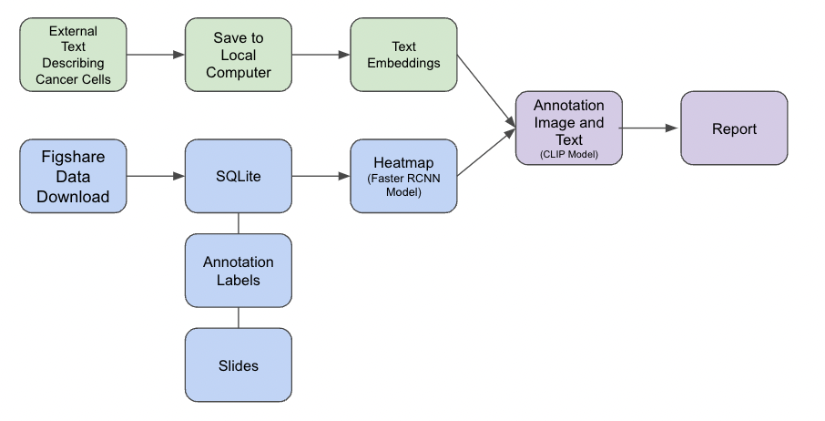

# Automating Explainability in Healthcare

## Project Description
### Motivation
The purpose of this project is to use AI and machine learning to flag cancerous cells on whole slide images of tissues. 
Today, the identification of mitotic cells is manually done by pathologists reviewing highly enlarged images and recording
annotations in a tool. This is difficult as it requires subject domain expertise, it is difficult to articulate reasons,
and often times costly due to conflicting diagnosis of the same image by different pathologists.

### How can AI and Machine Learning Help?
Using artificial intelligent techniques in computer vision, we can train models on cancerous images of canine tissue before
testing efficacy on human tissue. AI can detect similar cancerous areas missed by the human eye in existing images and in
newer images. We have trained simple NN models on annotated tissue data and look to further use NLP to assign texts to these
diagnosis. The goal is to have a report that meets the standards of a typical pathologist before it reaches other medical doctors.

### Challenges We Faced
Some of the challenges we faced include acquiring the same dataset used by the original authors of this project as there
were unknowns in technologies used and sometimes conflicting versions. Other challenges included finding the appropriate text
to further annotate the slide images to provide a robust explanation to doctors. Other challenges included creation of a
machine learning pipeline that seamlessly accepts a slide image as an input and outputs a detailed report.

## How to Use the Project Repo
### Folder Structure
- The `assignments/` folder contains all weekly assignments related to the progression of this project.
- The `data/` folder contains the image data that is saved locally. It is empty as it is good practice to exclude data from
the repo using a .gitignore file.
- The `models/` folder contains the fully saved trained models to be used in deployment.
- The `notebooks/` folder contains all .ipynb files containing all data science work done throughout this project.
- The `prework/` folder contains all code by the original authors that serves as a baseline for this core project.
Bits and pieces of the code in this folder related to databases and data collection served as a stepping stone for our work.
- The `references/` folder contains all articles and code samples from across the web in which we took inspiration from to use in our project.
- The `reports/` folder contains any reports or visualizations that were used to aid in presenting the project.
- The `src/` folder contains all source code and scripts to download and process the data, preprocess data into the appropriate features,
code to train, test and validate models, and all appropriate code to create visualizations.
### Miscellaneous Files
- This repo has a `.gitignore` file to remove any local work/data not needed for the repo.
- This repo has a `requirements.txt` file that matches exactly what was needed to run all code in this repo successfully.

----

## Data Lineage
The following chart shows how we envisioned data to propagate in our machine learning pipeline.

----

## ML Pipeline Diagram

----

## Methodology
### 1. Mitotic Object Detection on Whole Slide Images

### 2. Cell Patch Classifier
Convolution neural network model serves as the base model to perform predictions.
- Goal: Sampled Whole Slide Image (Input) -> Binary Classification: Mitotic Prediction (Output)

### 3. Visual Explainability using GradCAM
GradCAM is used to highlight specific regions of the image that help explain and contribute to the prediction of mitotic or non-mitotic.
- Goal: Mitotic Detected Image (Input) -> Mitotic Image Heatmap (Output)
- Convolutional neural network model is used as main classifier for prediction
- CAM layer is included in CNN architecture before the output layer to help visualize image embedding space that explains predictions

### 4. Textual Explainability using Dual Encoder
A dual encoder neural network was built using two main components, a vision encoder and a text encoder. 
- Goal: Mitotic Detected Image (Input) -> Natural Language Explanation (Output) 
- Image embeddings are created through the vision encoder via a pretrained Xception (ImageNet) neural network architecture.
- Text embeddings are created through the text encoder via a pretrained BERT (English Uncased) neural network architecture.
- Dual encoder learns image-to-text embeddings by minimizing the average loss over the image and text loss functions. 

----

## Deployment Stack

This is currently a work in progress.

----

## Presentation Link

[Demo-Day Final Presentation](https://docs.google.com/presentation/d/1qVjWvsBBks1P_PwFxf3sq1w35kqOuX_a/edit?usp=sharing&ouid=105719478312012717747&rtpof=true&sd=true)

## Contributors
- Shelly Jain, *VP, JPMorgan Chase*
- Artemio Rimando, *Data Scientist, ArcSpan*
- Gage Sowell, *Production Engineer, Flir*

## Thank You
- FourthBrain
- Samsung (Sponsor)
